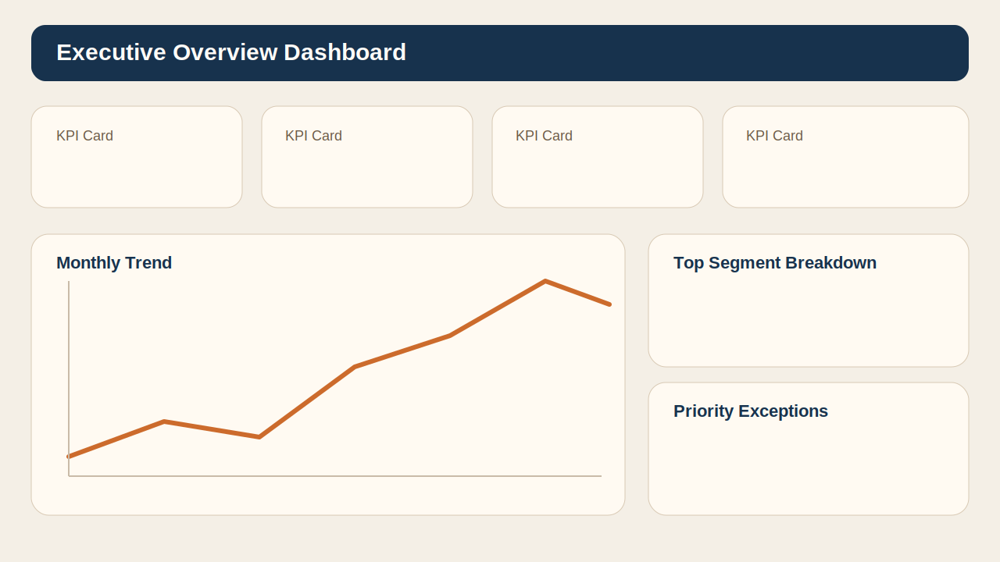
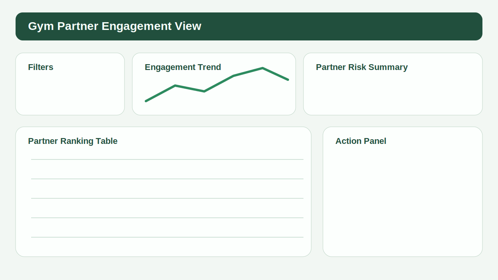
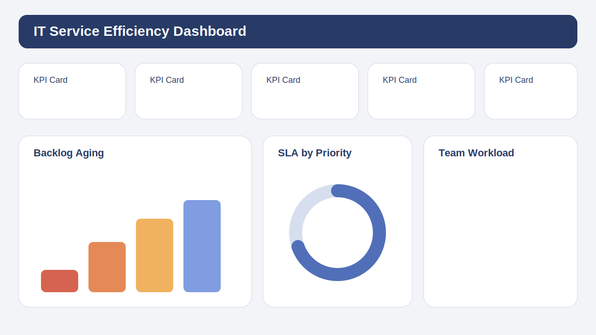

# Dashboard Design Notes

This folder shows how I structure BI dashboards for decision-making, KPI storytelling, and executive usability. The examples below are based on synthetic scenarios only and were designed to reflect how I typically organize metrics for business and operations audiences.

## Dashboard Strategy

I design dashboards with three layers in mind:

1. Executive layer: headline KPIs, trend direction, and immediate business status
2. Diagnostic layer: drill-down dimensions that explain what changed
3. Action layer: operational details that support prioritization and follow-up

## KPI Structure I Prefer

- Outcome KPIs: revenue, retention, SLA compliance, churn, member engagement
- Diagnostic KPIs: segment mix, partner performance, aging buckets, resolution stages
- Action KPIs: accounts at risk, tickets breaching SLA, inactive members, backlog owners
- Trust signals: last refresh timestamp, metric definitions, filter context, and exception notes

## Example 1: Executive Overview

Typical content:

- 4 to 6 top KPI cards with short labels and strong contrast
- A monthly trend line for quick pattern recognition
- Comparison against target or previous period
- One summary chart to show where attention should go first

UX choices:

- Important numbers are placed in the top-left reading area
- Color is used sparingly and reserved for meaning, not decoration
- Labels are written in business language instead of technical field names

## Example 2: Partner Engagement View

Typical content:

- Ranking table for partner gyms by engagement score
- Member activity trend by month
- Filters for region, partner, plan type, and cohort
- Risk indicators for declining attendance or high inactivity share

UX choices:

- Tables support drill-down, but the first screen still answers the main business question
- Benchmarks and trend deltas are visible without extra clicks
- Slicers are grouped to avoid clutter and inconsistent navigation

## Example 3: IT Service Efficiency View

Typical content:

- SLA attainment, backlog aging, and first response time in the header
- Ticket flow by status and priority
- Team or technician view for workload balancing
- Open issues requiring intervention highlighted in a focused detail section

UX choices:

- Operational metrics are separated from executive metrics to reduce noise
- Aging buckets are prioritized because they support daily management decisions
- The page layout supports both scan-first behavior and detailed diagnosis

## UX Principles I Apply in BI

- Every page should answer one primary business question clearly
- Users should understand status within the first five seconds
- Drill paths should feel intentional, not accidental
- Metric definitions must be consistent across pages
- Mobile and lower-resolution screens should still preserve hierarchy and readability

## Data Modeling Behind the Visuals

I typically design dashboards on top of a simple and scalable analytical model:

- Fact tables for events such as check-ins, bookings, invoices, subscriptions, or tickets
- Dimension tables for entities such as member, partner, account, technician, or calendar
- Clear date grain and business definitions to avoid duplicated logic in the BI layer
- Reusable measures so KPI calculations remain consistent across reports

