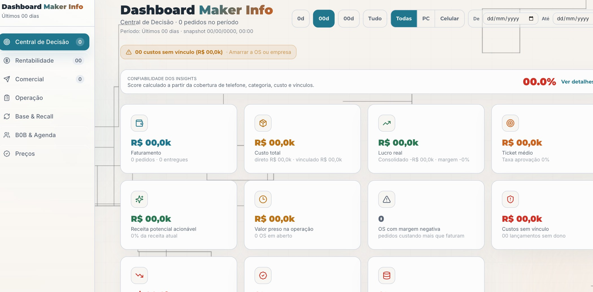
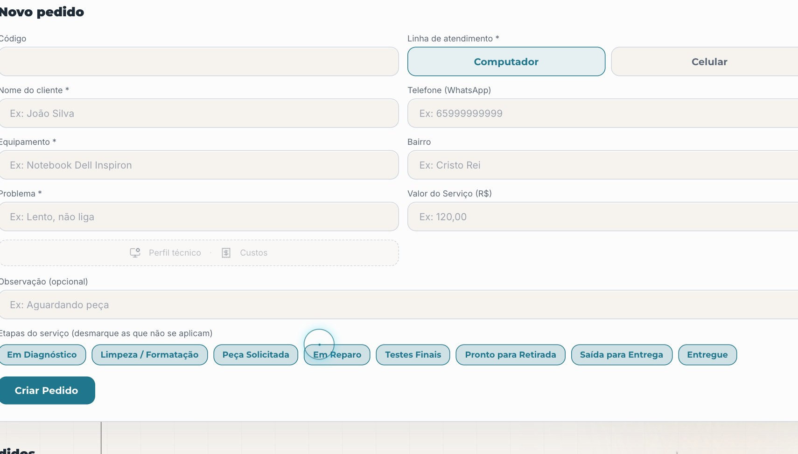

# Data Analytics Portfolio Showcase

Solving business problems through data, process intelligence, and decision-ready analytics.


This public portfolio showcases how I approach SQL problem-solving, Python automation, dashboard design, and data modeling in business-facing analytics scenarios.

All examples in this repository use synthetic scenarios and fictitious entities only. The portfolio is centered on a fictitious analytical version of the Maker Info service operations system, with no sensitive, proprietary, or real company data included.

## About Me

I am a Brazil-based data professional with a background that combines Analysis and Systems Development (ADS), BI internship experience, and founder-led operational work. I enjoy translating workflow friction into structured datasets, business KPIs, and decision-ready reporting.

This portfolio is designed for international Data Analyst and Business Intelligence opportunities, especially roles connected to operations, service performance, profitability, and decision support. Working languages: Portuguese, English, and Spanish.

## Tech Stack

- `SQL`: analytical querying, CTEs, joins, window functions, KPI logic, and operational analysis
- `Python`: pandas-based cleaning, automation workflows, reproducible data preparation, and portfolio generators
- `Power BI`: executive dashboards, operational scorecards, KPI storytelling, and UX-first layout decisions
- `Databricks`: notebook-based exploration, bronze/silver/gold pipeline design, and Delta-oriented thinking
- `Git`: version control, clear documentation, and public portfolio publishing

## Certifications

- Microsoft Power BI Professional Certificate `(Coursera, in progress - 2026)`
- Introduction to Data Science `(IE University / Santander - 2026)`

## Featured Projects

### 1. Maker Info Service Order Profitability Analysis

Synthetic analytics case focused on operational and financial visibility for a repair and support management system.

Business questions:

- Which service lines generate the best margin after linked and unlinked costs?
- Which client accounts are leaking profitability due to stalled orders or unassigned expenses?
- Which operational patterns should managers prioritize to protect cash flow?

Result snapshot:

- `B2B Support` and `Computer Repair` represent `82.8%` of allocated unlinked cost leakage in the synthetic environment.
- The weakest closed service-line snapshot is `Verde Health Clinic / Onsite Visit`, finishing at only `4.0%` net margin.

Key assets:

- [01_service_order_profitability_analysis.sql](/Users/kevin/maker-info-express/Data-Analytics-Portfolio-Showcase/SQL_Challenges/01_service_order_profitability_analysis.sql)
- [fact_service_order.csv](/Users/kevin/maker-info-express/Data-Analytics-Portfolio-Showcase/Synthetic_Data/fact_service_order.csv)
- [fact_cost_entry.csv](/Users/kevin/maker-info-express/Data-Analytics-Portfolio-Showcase/Synthetic_Data/fact_cost_entry.csv)

### 2. Maker Info Operational Dashboard and Recall Intelligence

Synthetic BI case built around the daily decision layer of the Maker Info system.

Business questions:

- Where is backlog aging accumulating and which queues deserve immediate intervention?
- Which KPIs should appear first for managers monitoring margin, SLA, and recall opportunities?
- How should dashboard UX support both executive scan speed and operational drill-down?

Result snapshot:

- The active backlog contains `22` orders, and all `22` are already older than `72h`.
- `in_repair` is the largest stalled status bucket with `9` orders, making it the first queue to review.




Key assets:

- [Dashboards/README.md](/Users/kevin/maker-info-express/Data-Analytics-Portfolio-Showcase/Dashboards/README.md)
- [02_operational_sla_backlog_analysis.sql](/Users/kevin/maker-info-express/Data-Analytics-Portfolio-Showcase/SQL_Challenges/02_operational_sla_backlog_analysis.sql)
- [03_customer_recall_reactivation_analysis.sql](/Users/kevin/maker-info-express/Data-Analytics-Portfolio-Showcase/SQL_Challenges/03_customer_recall_reactivation_analysis.sql)

### 3. Service Order Data Quality Pipeline

Python-based cleaning workflow built to normalize raw operational exports before analysis or BI consumption.

Business questions:

- How can a messy CSV export become a reliable analytical dataset?
- Which fields need canonical status mapping, numeric normalization, and risk flags?
- How can the same cleaned dataset support both dashboarding and downstream pipeline work?

Result snapshot:

- The cleaning workflow standardized `72` raw service orders into `6` canonical statuses.
- The cleaned dataset surfaced `31` `critical_delay` records and `36` `sla_breached` orders for monitoring.

Key assets:

- [clean_service_orders_data.py](/Users/kevin/maker-info-express/Data-Analytics-Portfolio-Showcase/Python_Automation/clean_service_orders_data.py)
- [service_orders_raw.csv](/Users/kevin/maker-info-express/Data-Analytics-Portfolio-Showcase/Synthetic_Data/service_orders_raw.csv)
- [service_orders_clean.csv](/Users/kevin/maker-info-express/Data-Analytics-Portfolio-Showcase/Synthetic_Data/service_orders_clean.csv)

## Databricks Mini Pipeline

To support the Databricks item in the stack with a concrete artifact, this repository also includes a small notebook-source PySpark pipeline that reads the cleaned service order dataset and organizes it into bronze, silver, and gold layers.

What it does:

- Reads `service_orders_clean.csv` into a bronze Delta table
- Builds a typed silver operational order table
- Publishes `gold_daily_operations_kpis` and `gold_company_profitability`

Key assets:

- [Databricks_Pipeline/README.md](/Users/kevin/maker-info-express/Data-Analytics-Portfolio-Showcase/Databricks_Pipeline/README.md)
- [maker_info_medallion_pipeline.py](/Users/kevin/maker-info-express/Data-Analytics-Portfolio-Showcase/Databricks_Pipeline/maker_info_medallion_pipeline.py)

## Repository Structure

```text
Data-Analytics-Portfolio-Showcase/
|-- README.md
|-- .gitignore
|-- requirements.txt
|-- SQL_Challenges/
|   |-- 01_service_order_profitability_analysis.sql
|   |-- 02_operational_sla_backlog_analysis.sql
|   `-- 03_customer_recall_reactivation_analysis.sql
|-- Python_Automation/
|   |-- clean_service_orders_data.py
|   `-- generate_synthetic_portfolio_data.py
|-- Databricks_Pipeline/
|   |-- README.md
|   `-- maker_info_medallion_pipeline.py
|-- Synthetic_Data/
|   |-- README.md
|   |-- dim_company.csv
|   |-- dim_customer.csv
|   |-- dim_technician.csv
|   |-- fact_service_order.csv
|   |-- fact_order_status_history.csv
|   |-- fact_cost_entry.csv
|   |-- fact_customer_contact.csv
|   |-- service_orders_raw.csv
|   `-- service_orders_clean.csv
`-- Dashboards/
    |-- README.md
    `-- assets/
        |-- dashboard-executive-overview.jpg
        `-- dashboard-operational-input.jpg
```

## Synthetic Data Pack

This repository also includes a reproducible synthetic data pack so the portfolio can be explored without any dependency on real business data.

- Service order tables for profitability, SLA, backlog, and recall analysis
- Operational cost and status history data for dashboard prototyping
- Customer contact history for recall and commercial follow-up use cases
- A deliberately messy service order export for Python-based data cleaning
- A cleaned service order export that demonstrates the output of the pandas workflow

## Quick Start

```bash
pip install -r requirements.txt
python Python_Automation/generate_synthetic_portfolio_data.py
python Python_Automation/clean_service_orders_data.py \
  --input Synthetic_Data/service_orders_raw.csv \
  --output Synthetic_Data/service_orders_clean.csv \
  --reference-date 2026-04-15
```

## Professional Objective

I am pursuing Data Analyst and Business Intelligence roles in the international market, especially positions focused on operational analytics, service performance, margin visibility, and data-driven decision support. I am comfortable working across Portuguese, English, and Spanish environments.

## Contact

- LinkedIn: [Kevin Savio on LinkedIn](https://www.linkedin.com/in/kevin-savio-data/)
- Email: [kevinsavio514@gmail.com](mailto:kevinsavio514@gmail.com)
